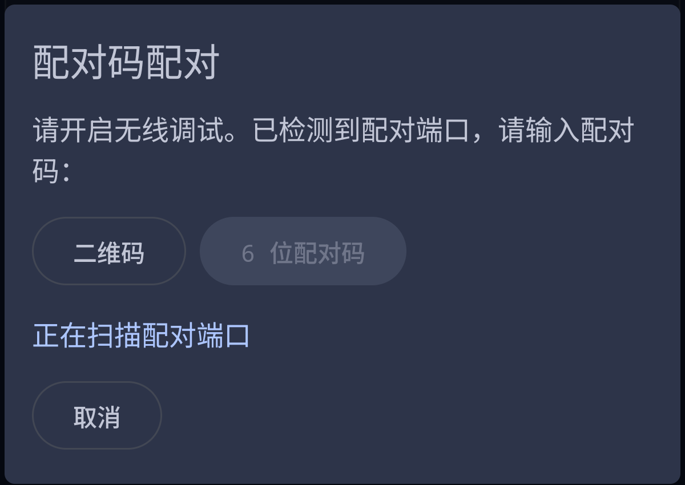
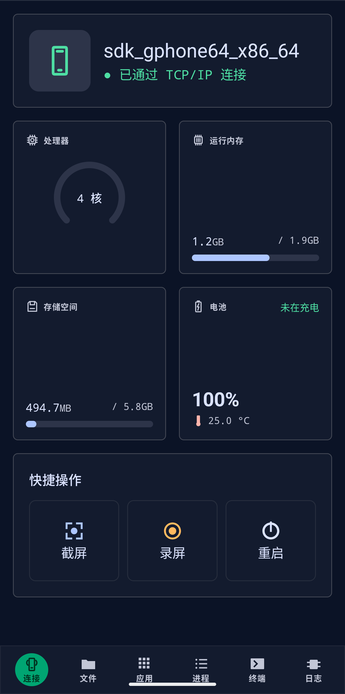
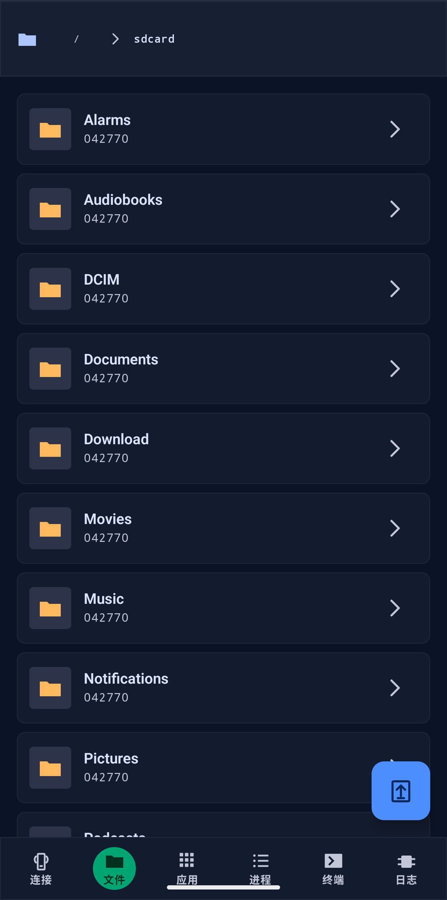
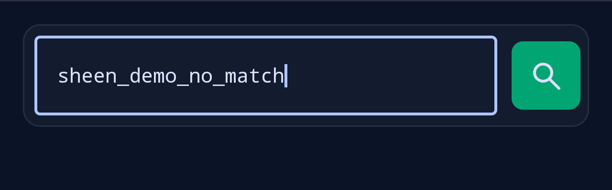
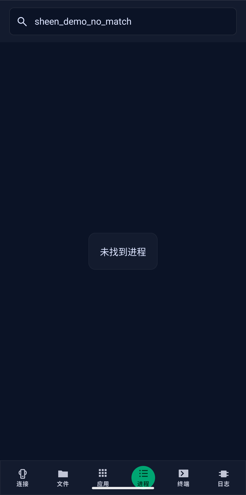
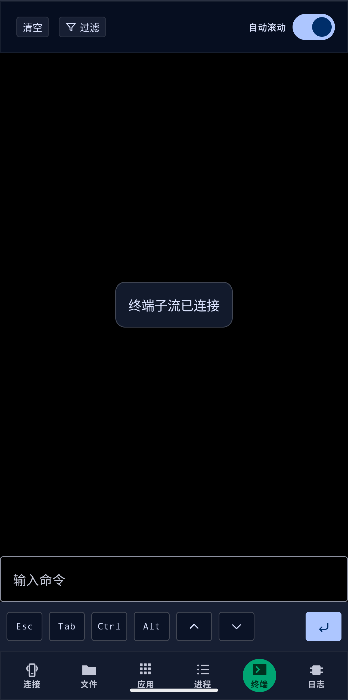
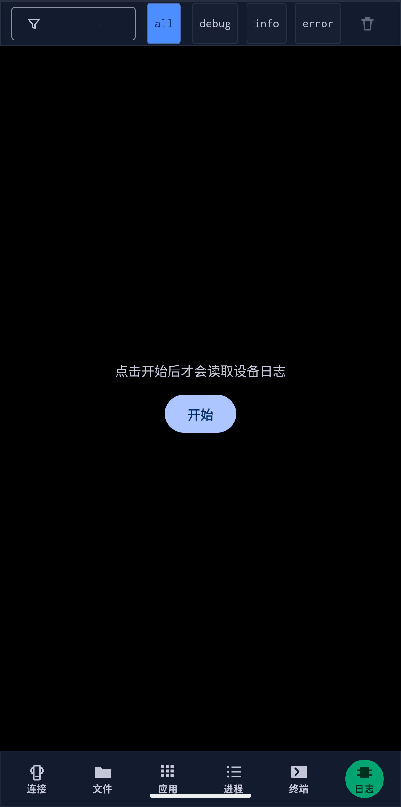

# Sheen ADB 助手

把一台 Android 设备变成随身 ADB 工具：在同一网络中连接另一台 Android 设备，直接管理文件、应用和进程，使用 Shell 与 Logcat，并执行截屏、录屏等常用操作。

- 纯本地运行，无账号、后端、广告或遥测。
- 不需要电脑常驻，不使用 Root、Shizuku 或无障碍服务。
- 配对、认证和设备操作均由 App 自身完成。
- 当前用户可见版本：`v1.0`。

## 可以做什么

- 发现、配对并连接 Android 设备（含安卓11以下设备）的无线调试服务。
- 查看处理器、内存、存储和电池概览。
- 浏览被控端目录，在两台设备之间上传或下载文件。
- 搜索应用，提取或安装 APK，并管理普通应用状态。
- 查看和筛选进程，按进程或应用结束任务。
- 使用持续交互式 Shell，支持过滤、自动滚动和常用特殊键。
- 按需采集、筛选、保存 Logcat；离开页面即停止采集。
- 对被控端截屏、录屏或发送重启请求。

## Android 16 → Android 12 演示

下面的画面来自真实模拟器运行：Android 16 作为主控端，Android 12 作为被控端。两台模拟器使用独立 TAP 接入同一个隔离测试网络；无线调试的发现、配对、认证和连接由 Sheen ADB 助手完成，没有使用 host `adb pair` 或 `adb connect` 代替产品能力。

为避免记录敏感数据，截图裁掉了已连接页面顶部的真实端点栏；应用和进程页使用无匹配演示关键词，Shell 已清空，Logcat 保持未采集状态。

### 1. 配对与连接

App 可扫描系统公布的无线调试服务，并支持二维码、六位配对码和本机配对。
安卓11以下设备请直接连接5555端口。



### 2. 设备概览与快捷操作

连接后可以查看设备状态，并从同一页面发起截屏、录屏或重启。



### 3. 文件管理

浏览被控端目录，通过行尾按钮进入文件夹或下载文件，也可以从主控端上传文件。



### 4. 应用管理

按应用名或包名搜索；普通应用可提取 APK、禁用或启用、强制停止和卸载，右下角入口用于安装主控端 APK。



### 5. 进程管理

即时筛选进程，并在页面可见时定期刷新 CPU 与内存数据。



### 6. 交互式 Shell

命令在被控端执行；终端提供清空、过滤、自动滚动、Esc、Tab、Ctrl、Alt 和方向键。



### 7. 按需 Logcat

进入页面不会自动读取日志。点击开始后才采集，可按文本和 `all/debug/info/error` 过滤，并保存本次完整采集窗口。



## 快速开始

1. 在被控端打开“开发者选项 → 无线调试”，并确认两台设备位于同一网络。
2. 在 Sheen ADB 助手连接页选择发现的设备；首次使用时按提示完成二维码或六位码配对。
3. 配对成功后等待 App 自动连接，或从无线调试主页面输入当前连接端点。
4. 通过底部导航进入文件、应用、进程、终端或日志页面。

配对端口和连接端口不是同一个端口，而且可能随无线调试重新启用而变化。App 不会替用户绕过系统授权。

## 隐私与安全

- ADB 主机身份由 Android Keystore 包装保护。
- 配对码、二维码口令和服务信息只在当前配对过程的内存中短暂存在。
- Shell、进程和 Logcat 内容默认不落盘。
- 文件、APK、日志、截屏和录屏只写入用户通过系统文件选择器指定的位置。
- 卸载、强制安装、结束进程、重启和高风险 Shell 等操作需要明确确认。

详见 [隐私政策](docs/privacy-policy.md) 与 [权限矩阵](docs/权限矩阵.md)。

## 系统与构建

- 构建环境：JDK 21、Android SDK 36、Gradle Wrapper。

```powershell
.\gradlew.bat testDebugUnitTest lintDebug assembleDebug
.\gradlew.bat assembleRelease
```

## 工程文档

- [工程宪法](.specify/memory/constitution.md)
- [Spec Kit 工作流](docs/Spec-Kit工作流.md)
- [当前架构事实](docs/architecture/)
- [功能规格与计划](specs/)
- [第三方依赖与许可证](docs/第三方依赖与许可证.md)

许可证：Apache-2.0。
